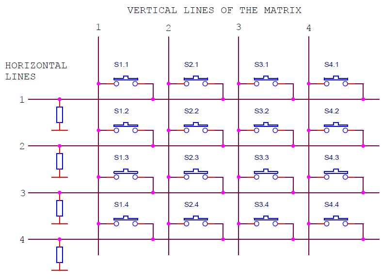

This week we began further exploring how we can implement having an interactable LED matrix with the use of buttons.  We also began making the buttons for the LED tile wall, and planning out the board frame.

## Button Matrix

The answer to this was a button matrix. How it would work was that all buttons are individually connected to one row and one column. When a button is pressed, it would connect a row and column, which allows the Arduino to pinpoint its location in the matrix. 

For example, if a button on row 2 and column 3 lights up, the Arduino would receive an input from Row 2 and column 3. As there's only one button that can light up those specific lines, the matrix knows the exact button being pressed and activates any related code respectively.

Here is a diagram showing the button matrix concept.

We had several attempts at getting this to work right. There were issues setting it up of which were hard to solve because we didn't really know where the problem originated from. Eventually though we figured out how to properly set up the button matrix, and so it was good to begin soldering them together.

## Tiles

For the tiles, they were square acrylic sheets that needed to be made into translucent objects. This would allow it so that light can flash colours through without exposing the buttons and wiring underneath. 

We tested layering paint on the acrylic panels, but this method made the panels stick together whilst drying and was not exactly what we desired.